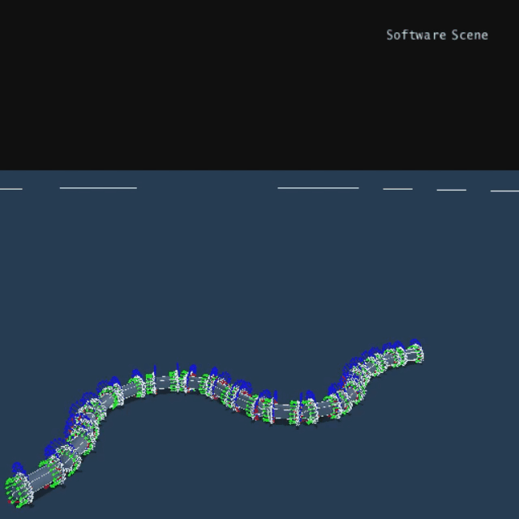
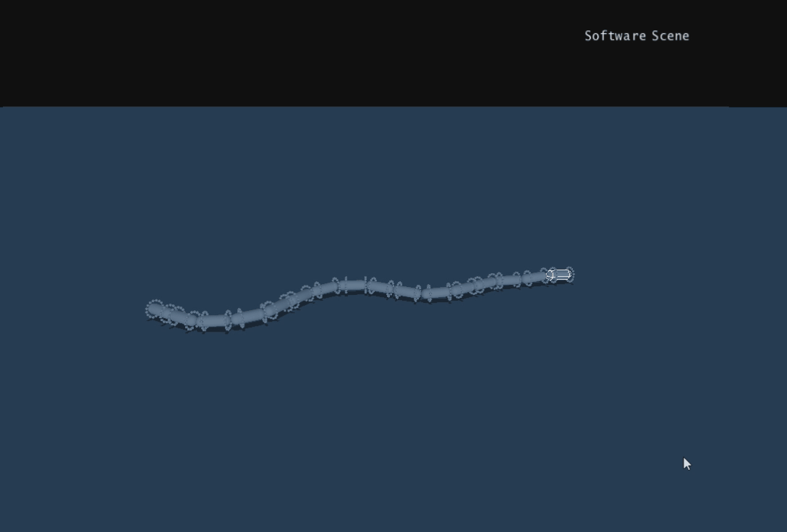
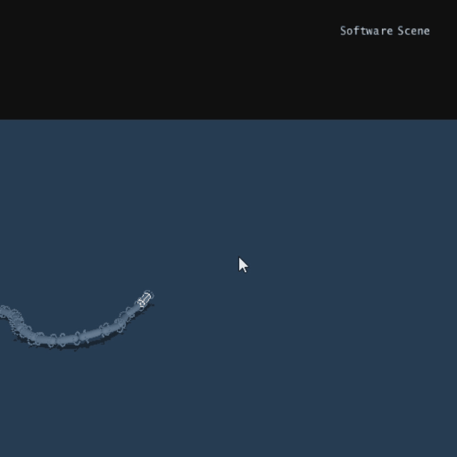
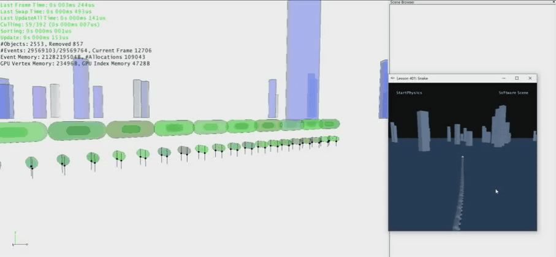
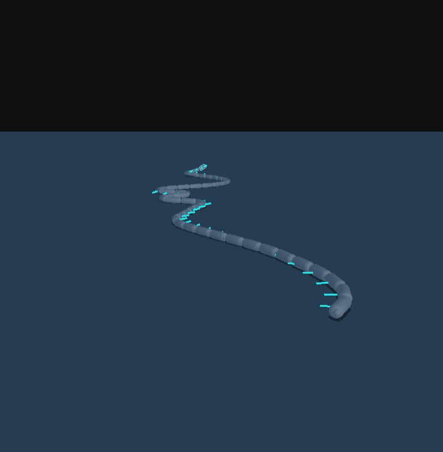

# 记录一下蛇类模拟过程中的一些效果

## 原型设计

### PhysX2.8环境原型设计

#### 单轴驱动

#### 双轴驱动

##### 双轴同频运动效果

双轴蠕动

这个像龙，我很喜欢

双足支撑效果

波动效果

波动及爬墙

### PhysX4.0环境原型设计

自动朝向调整效果

柱体与墙面间移动

### UE4环境原型设计

爬斜面效果

越障

柱间移动

带动骨骼

